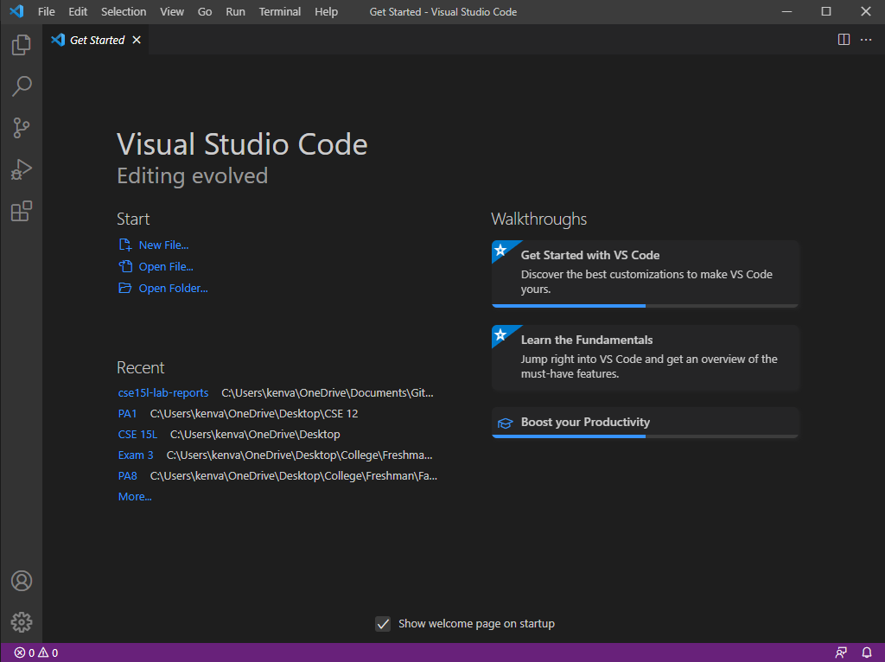
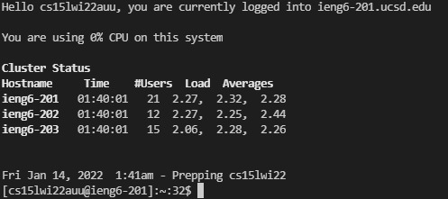
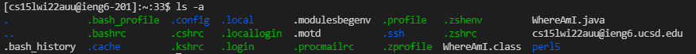
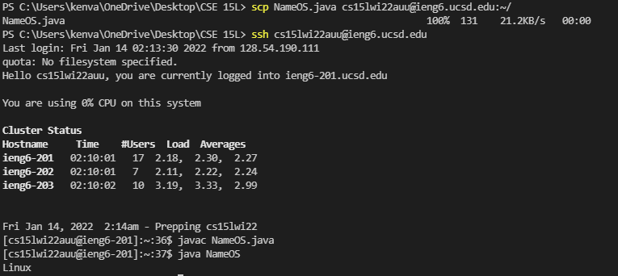
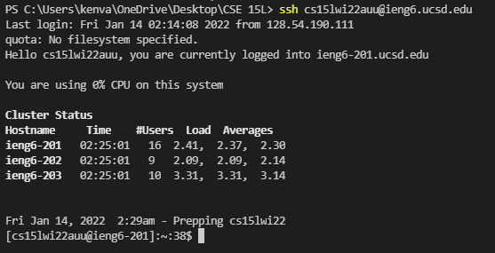
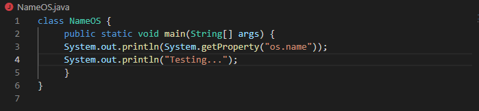
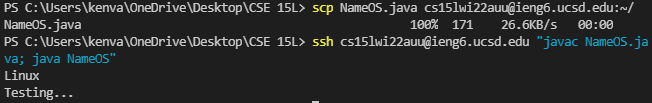

# How To Log Into Your Course-Specific Account On IEng6 #
### Installing VSCode:
---
- First, navigate to the [vscode website](https://code.visualstudio.com/)
- Then, download **vscode** for whatever operating system you're running. (In my case, windows)

> Once installed, open it up. It should look roughly like this:
>
>
>

### Remotely Connecting:
---
- First, look up your account for CS15L in the [Account Lookup Tool](https://sdacs.ucsd.edu/~icc/index.php)
- Then, open a new terminal in vscode and enter the following code snippet: `ssh cs15lwi22###@ieng6.ucsd.edu`, replacing ### with your 3 letter CS15L account name. (In my case, it's cs15lwi22auu@ieng6.ucsd.edu, which I'll use for the rest of this tutorial)
- Agree to continue connecting when prompted.
- Enter the password to your CS15L account when prompted

**And Presto!**
>Your terminal should produce an output similar to this:
>
>

### Trying Some Commands:
---

Some commands you might want to test out both on the client-side (your computer) and the server-side (the remote computer) include:

- `cd`
- `cd ~`
- `ls -lat`
- `ls -a`
- `ls /home/linux/ieng6/cs15lwi22/cs15lwi22###` (replacing ### with another student's account name)

You can also type `CTRL + D` to logout of the server.

>As an example, here is what ls -a does when it's ran while connected to the server:
>
>
>
>From this, we can deduce that perhaps calling `ls -a` lists all the files present within the current directory.

For the rest of these commands, try to deduce what they do, and how their behavior **differs** between client and server.

### Moving Files Using SCP
---
The `scp` command allows you to copy code from your local computer to a remote computer. We're going to try it out for ourselves!

- First, copy the following code snippet and save it in a file named NameOS.java:

> class NameOS {  
> &nbsp;&nbsp;&nbsp;&nbsp; public static void main(String[] args) {  
> &nbsp;&nbsp;&nbsp;&nbsp;  System.out.println(System.getProperty("os.name"));  
> }

- Then, in the terminal from the **directory where you made this file**, run the command: 
`scp WhereAmI.java cs15lwi22auu@ieng6.ucsd.edu:~/`
- Enter the password when prompted
- Log back into the server by running `ssh cs15lwi22auu@ieng6.ucsd.edu`
- Then, run `javac NameOS.java` and `java NameOS`

> Your terminal should look like the following (though the password step is ominously missing... *ooh foreshadowing*):
> 
>

### Setting an SSH Key ###
---
*I don't quite remember the setup process we did for Windows-based computers, so I'll just go over the non-Windows implementation*

- Start by opening a new terminal
- Enter `ssh-keygen` and press enter three times for the following three prompts
- You should see some sort of randomart pop up (*I won't show this with a screenshot because I don't want to override my ssh key*)
- Now, log into the server once again [`ssh cs15lwi22auu@ieng6.ucsd.edu`] (and fill in the password prompt)
- Run `mkdir .ssh`
- Logout, either by typing `exit` or doing the keyboard shortcut `CTRL + D`
- On client, run scp `/Users/yourusername/.ssh/id_rsa.pub cs15lwi22auu@ieng6.ucsd.edu:~/.ssh/authorized_keys`

> Afterwards, your login process should no longer contain the password prompt and typing `ssh cs15lwi22auu@ieng6.ucsd.edu` should get your directly in, like in the following screenshot:
> 
>

### Optimizing Remote Running ### 
--- 
Something I'm sure you've noticed is that copying code from your computer to a remote server, logging into the terminal, compiling your code and running it takes a decent amount of time. A decent amount of time that becomes a lot of **wasted** time when you're going through these motions **many, many many** times as you might have to when writing/debugging a program.

One way I've come up with to save time running a single file is to do the following:
- Open a notepad document
- Copy the following commands to it (updating *v* with your filename):   `scp v.java cs15lwi22auu@ieng6.ucsd.edu:~/`  
`ssh cs15lwi22auu@ieng6.ucsd.edu "javac v.java; java v"`
- When you want to run your program quickly and see the output, **copy + paste** the first, *enter*, then the second command, *enter*, and it should do the whole process of running the program and logging out for you.

> To demonstrate the utility of this, let's make a change to NameOS.java
> 
> Then, let's show how easily we can update and run this new program on the server.
> 

To run the program, we only need 10 keystrokes:
1. Select `scp v.java cs15lwi22auu@ieng6.ucsd.edu:~/` from your notepad document
2. Copy the snippet by pressing **CTRL + C** (for windows)
3. Click into your VSCode terminal
4. Paste the snippet by pressing **CTRL + V** (for windows)
5. Press your **enter** key.
6. Select `ssh cs15lwi22auu@ieng6.ucsd.edu "javac NameOS.java; java NameOS"` from your notepad document
7. Copy the snippet by pressing **CTRL + C** (for windows)
8. Click into your VSCode terminal
9. Paste the snippet by pressing **CTRL + V** (for windows)
10. Press your **enter** key.

As you can see, we can save a lot of time just copy-pasting these commands in! This can be really handy for assignments where you need to fiddle with the code a lot.
