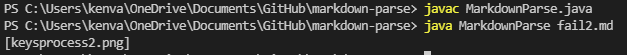
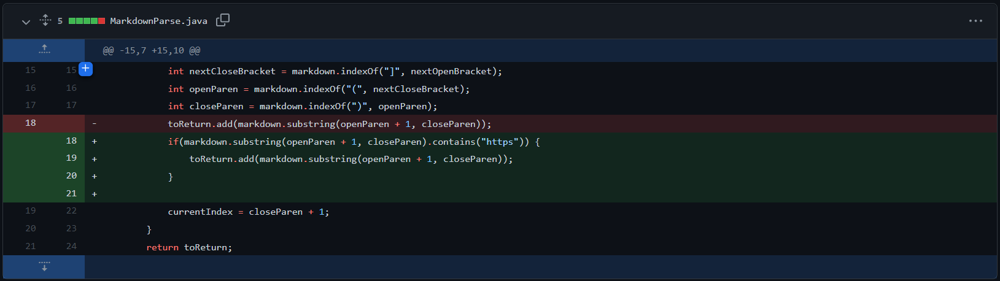
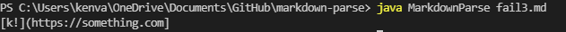
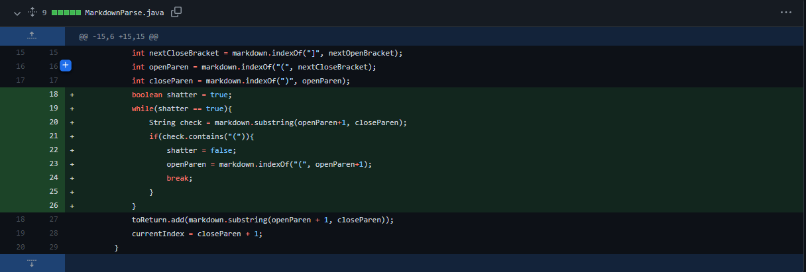
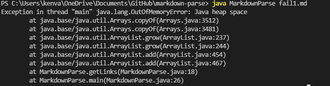
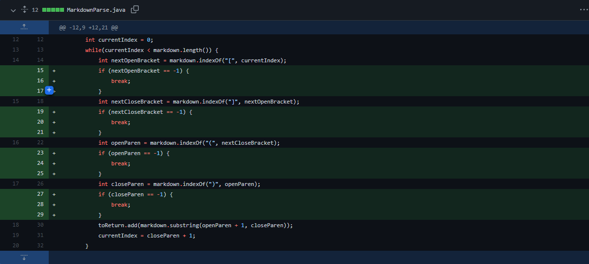

# Lab Report 2 Week 4: **MarkdownParse Debugging**

### Formatting of this report:
* Link to test file
* Output of failure-inducing input showing symptom (failure)
* Screenshot of code differential of our fix
* 2-3 *(might've done a little more)* sentences describing relationship between bug, symptom and failure-inducing input

## First Bug Fix:

Here is the failure-inducing input [test file](https://github.com/fighterkabir/markdown-parse/commit/0e05f82551ef8c36d66acbe3d82309b472dfdd9d)

This was my output from running the base MarkdownParse.java code on this file:
>
> 
>

* This output can be considered a **failure** because the purpose of our Markdown parser was to obtain and print all (*and only*) the links in the file. Image filenames should **not** be treated as links. 

Recognizing this symptom, we made the following adjustments to our MarkdownParse.java file:

> 
> 
> 

* The **bug** in this case is that the Parser previously recognized anything enclosed in the parantheses of this structure `` as a link. It would thus fail to filter image filenames due to their similar structure `` and include them in the **final output** with links, making image filenames a **failure-inducing input**. Our fix was to discriminate a link from other input by the common `https` header in links. 

## Second Bug Fix:

Here is the failure-inducing input [test file](https://github.com/fantasticfishman/markdown-parse/commit/5c75bdd0f93c274757cfc52fb43b521f0a53cd9c)

This was my output from running the base MarkdownParse.java code on this file:
>
> 
>

* This output is a failure because `k!](` is not properly filtered as a non-link, and is included in the final output which should be just the links in the file.

We thus made the following adjustments to our parser.
>
> 
>

* The **bug** in this case was that the Parser didn't check the content between the first open parantheses and the first closed parantheses. We thus got the **output** `k!](https://something.com]` because the Parser begun the toReturn substring at an earlier open parantheses in the file. The failure-inducing input is an independent (not matched with a corresponding closed parantheses) open parantheses placed before the first real link's `()` structure. Our fix was to check the contents between the first `(` and the first `)` for a second open parantheses. If one were found, we would start the link substring from the new `(`.

## Third Bug Fix

Here is the failure-inducing input [test file](https://github.com/phrzdgal/markdown-parse/commit/569e61e10de25c55b3d18249b32c9839f048870b)

This was my output from running the base MarkdownParse.java code on this file:

>
> 
>

* This failure is pretty obvious. Running the parser on this file causes a `java.lang.OutOfMemoryError`.

We thus made the following changes to our code:

>
> 
>

* The **bug** in this case is that if `indexOf` cannot find the next `[`, `]`, `(`, or `)`, it'll return -1, which when incremented by 1 at the end of each loop will make currentIndex 0. This means that currentIndex will never exceed markdown.length (assuming the file is of length > 0), and the loop will continue indefinitely, producing the OutOfMemoryError we saw in the **output**. The failure-inducing input is missing brackets or parantheses, as that would cause closeParen to be -1 before the incrementer, causing the loop to run indefinitely. To fix this, we added a if statements to check if we would need to break out of the loop due to missing brackets or parantheses.

