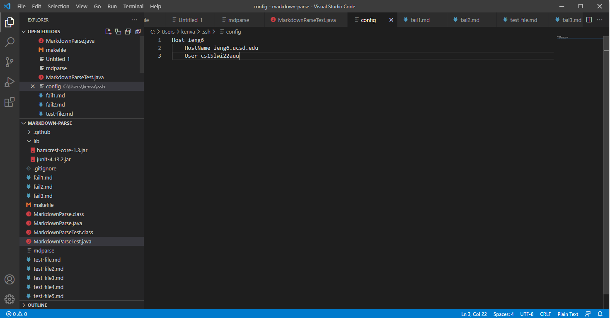
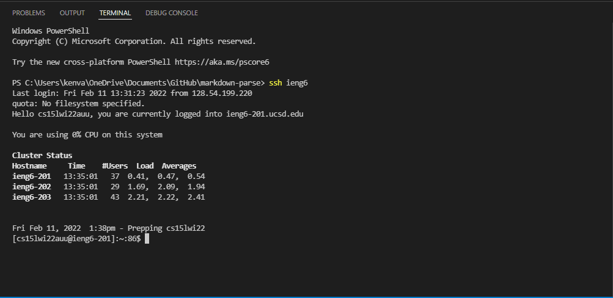
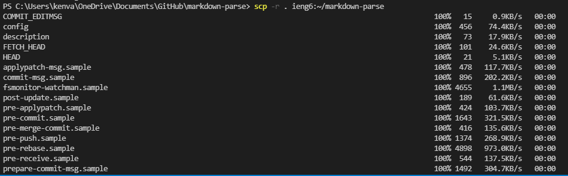
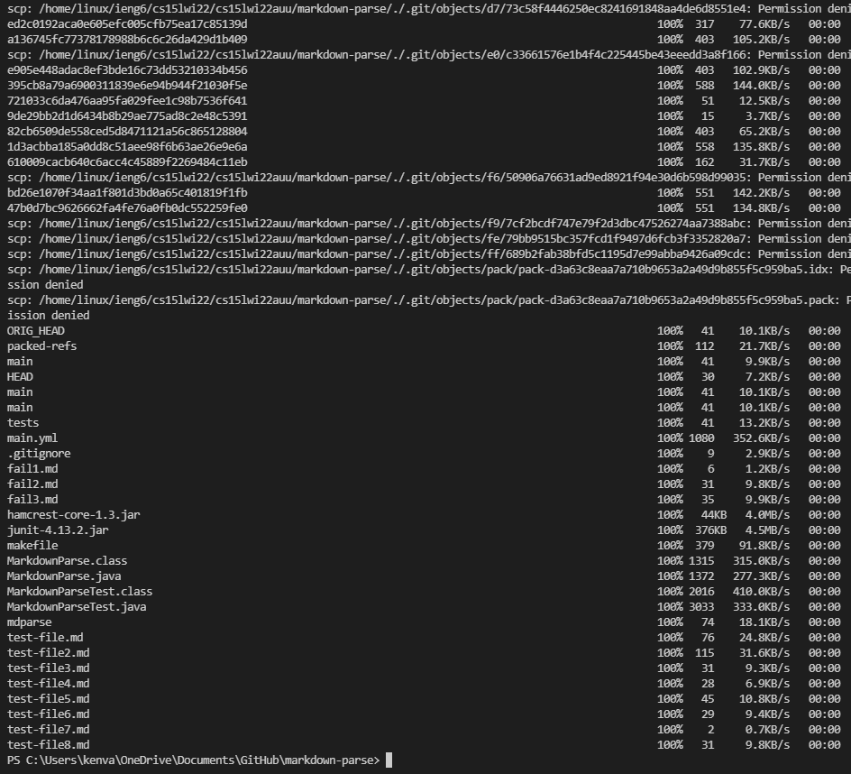

## Lab Report 3: Streamlining ssh Configuration.

### Editing my .ssh/config file:
> 

- After locating my .ssh folder under users, I created a new file inside .ssh named config. 
- I then opened the file with VSCode, and added the text depicted above to create the new alias.

### Logging into ieng6 using new alias with ssh command:

> 

- To log into ieng6 using the newly created alias, I simply opened a new terminal and entered the following code snippet `ssh ieng6`. 
- Compared to typing out my cs15lwi22auu@ieng6.ucsd account address every time I want to access the remote server, this method is much faster.

### Copying file(s) to your account using ssh command with new alias:

> 
> 

- To `scp` in code using the new alias, I can shorten the previous command `scp -r . cs15lwi22@ieng6.ucsd.edu:~/markdown-parse` to just `scp -r . ieng6:markdown-parse`.
- Running this command displays the depicted output, showing that the scp command did in fact run successfully with this new paradigm.

