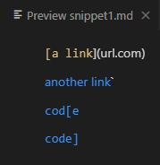
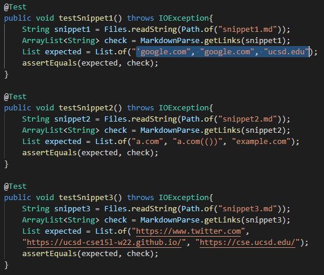
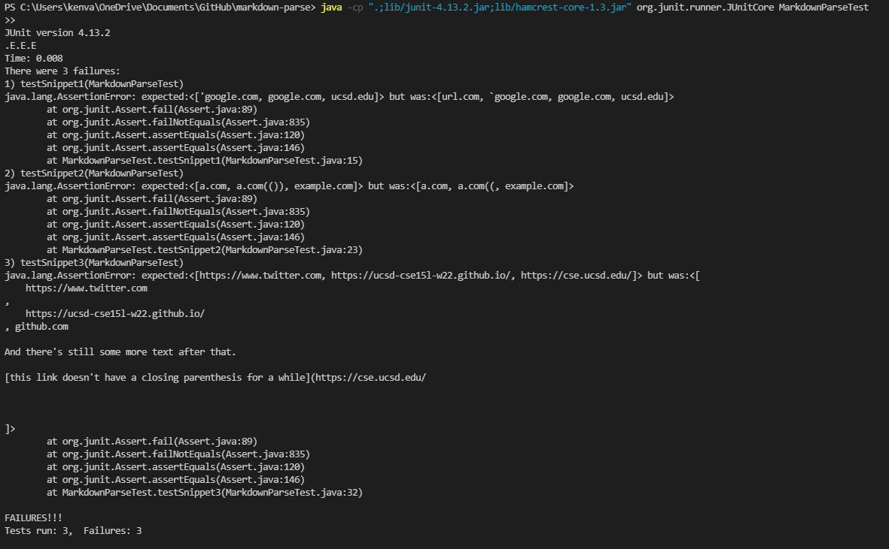
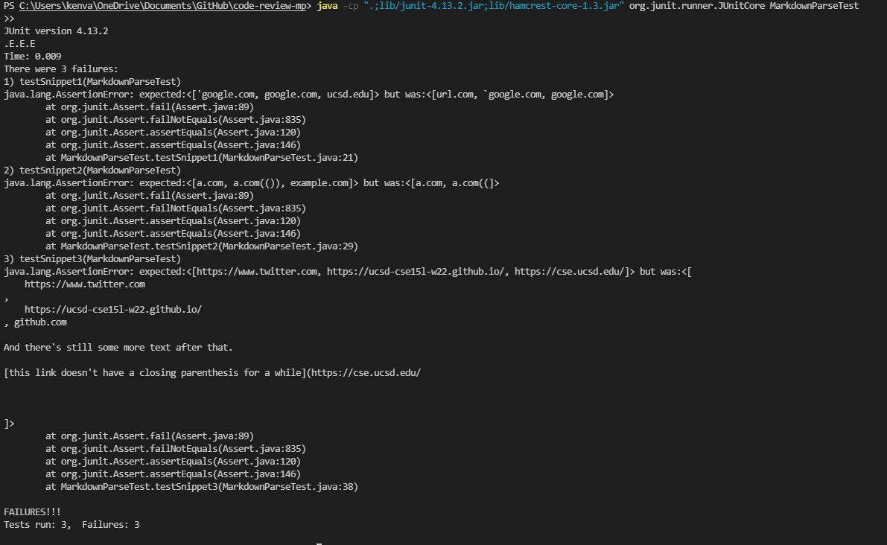
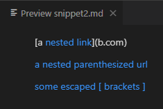
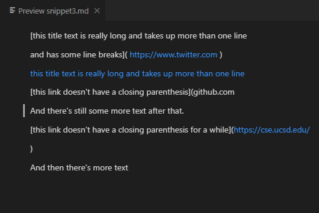

# Lab Report 4: 3 Snippets
- Link to my [markdown-parse directory](https://github.com/kenvaCS/markdown-parse)
- Link to reviewed [markdown-parse directory](https://github.com/LippsVega/markdown-parse) (*note that I'm using version I cloned a week ago*)

## Snippet 1:
### What *should* be produced:

- Based on the VSCode preview of this markdown file, we expect proper behavior 
from our markdown parser's getLinks() method to be returning three links: `'google.com`, `google.com`, and `ucsd.edu`

### Tests Created:

- The `testSnippet1` method is my test for the first snippet.

### Output on my implementation of MarkdownParse.java:

- The failing test is `testSnippet1`.

### Output on reviewed repo's implementation of MarkdownParse.java:

- The failing test is `testSnippet1`

## Snippet 2:
### What *should* be produced:

- Based on the VSCode preview of this markdown file, we expect proper behavior 
from our markdown parser's getLinks() method to be returning three links: `a.com`, `a.com(())`, and `example.com`

### Tests Created:

- The `testSnippet2` method is my test for the first snippet.

### Output on my implementation of MarkdownParse.java:

- The failing test is `testSnippet2`.

### Output on reviewed repo's implementation of MarkdownParse.java:

- The failing test is `testSnippet2`

## Snippet 3:
### What *should* be produced:

- Based on the VSCode preview of this markdown file, we expect proper behavior 
from our markdown parser's getLinks() method to be returning three links: `https://www.twitter.com`, `https://ucsd-cse15l-w22.github.io/`, and `https://cse.ucsd.edu/`

### Tests Created:

- The `testSnippet3` method is my test for the first snippet.

### Output on my implementation of MarkdownParse.java:

- The failing test is `testSnippet3`.

### Output on reviewed repo's implementation of MarkdownParse.java:

- The failing test is `testSnippet3`

## Potential Fixes:

### Do you think there is a small (<10 lines) code change that will make your program work for snippet 1 and all related cases that use inline code with backticks? 

> The issue appears to be that the backtick causes the open bracket to no longer be considered a valid part of the link structure. To fix this isn't simple, because we could have an errant backtick somewhere way earlier in the markdown file that still renders a bracket incomplete. For example ` dsdsdsdsdd   \n [a link`](link). We also can't just outright reject any link with a backtick, as the other lines in the file were considered valid. We would thus have to somehow check every if there is an "open" backtick active when we come across a backtick in the link that would "break" one of the brackets.

### Do you think there is a small (<10 lines) code change that will make your program work for snippet 2 and all related cases that nest parentheses, brackets, and escaped brackets?

> For snippet 2, the issue was that the link `a.com(())` was incorrectly parsed as `a.com((`. To fix this, we could implement a stack that stores the index of each open parantheses as we parse the link substring, popping from the stack whenever we encounter a closed parantheses. Once we reach the "closing" parantheses (the stack is empty), we would use that returned "earliest" open parantheses and the current index (at the closed parantheses) to create the substring to return.  

### Do you think there is a small (<10 lines) code change that will make your program work for snippet 3 and all related cases that have newlines in brackets and parentheses?

> For snippet 3, there are two issus that I discerned. One is that markdown doesn't care about indentation (which is to say, when returning the substring, we need to get rid of the empty space). The second issue is that the false github link (which doesn't have a closing parantheses) used the parantheses of the true 3rd link. To fix this, our implementation of a stack from the previous
snippet could come in handy, as we'd test for potential "nested" links provided
that the stack isn't empty, which would properly detect `https://cse.ucsd.edu/` as a link, while also not counting github.com as a link.

