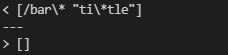
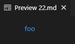
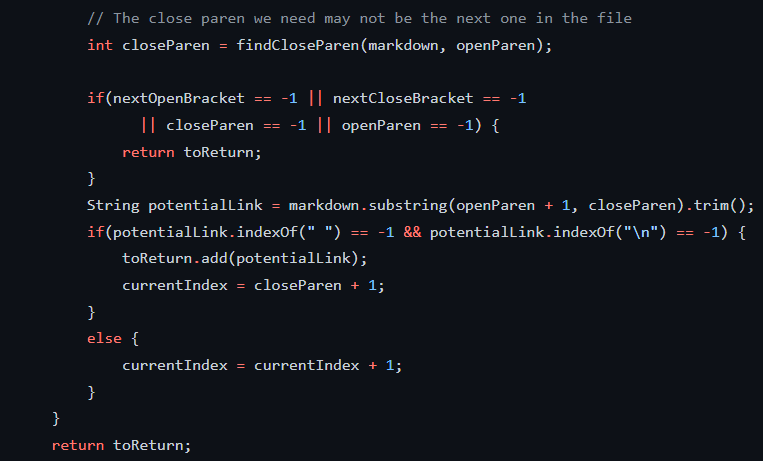
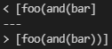
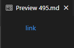
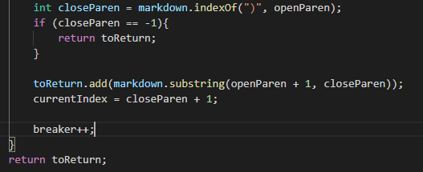

# **Lab Report 5**

### **Finding Tests With Different Results**
- To find the tests that produced different outputs between the provided implementation of MarkdownParse and my own, I first ran `bash script.sh` on both. 
- I had issues with output redirection, so I manually copy-pasted the output produced in terminal to a notepad document for both implementations. 
- I then ran `scp results_wk9parser.txt ieng6:~/` to move the files over. 
- Finally, I ran `diff results_myparser.txt results_wk9parser` in ssh in order to find the tests where the outputs were different.

### **First Test** *(test-files/test-22.md)*
- For this test, which contained the text `[foo](/bar\* "ti\*tle")` , my implementation (depicted on the top), returned `[/bar\* "ti\*tle"]` whereas the wk9 implementation returned an empty ArrayList `[]`. 

> 

- Based on the commonmark preview, we expect calling MarkdownParse on the **test-22 file** to produce:

> 
>
> *note that hovering over the link shows `ti*tle` as the link*

- In this case, then, both of our implementations are incorrect to some extent. I would argue week 9's implementation is slightly more incorrect as it completely does not recognize the present link, so I'll bugfind on week 9's implementation, specifically it's inability to find **a** present link.

- Here is the section of code that causes the issue:

> 

- The issue with this implementation is that because of the space between the asterisk and quotation marks in the substring contained between the open and closed parantheses (`[foo](/bar\* "ti\*tle"`), the if statement directly after our variable assignment for `potentialLink` determines potentialLink.indexOf(" ") to be non-1, which means we don't add the link to our ArrayList, and we proceed to the end of the line (and file, returning toReturn which is the empty ArrayList). 

### **Second Test** *(test-files/test-495.md)*
- For this test, which contained the text `[link](foo(and(bar)))`, my implementation (depicted on top) was `[foo(and(bar]` and Week 9's implementation was `[foo(and(bar))]`.

> 

- Based on the commonmark preview, we expect calling MarkdownParse on the **test-495 file** to produce:

> 
>
> *note that hovering over the link shows `[foo(and(bar))]`*

- In this case, clearly it is my implementation that has a bug in it, so I'll focus my bugfinding on my own implementation. 

- Here is the section of code that causes the issue:

> 

- The issue with this implementation is that because `.indexOf()` operates by finding the first appearance of the provided character, nested parantheses causes it to shorten the true link when it is added to `toReturn`. To fix this, I would have to adjust how we find closeParen to ensure its the "proper" corresponding closing parantheses to the first open parantheses in the link structure.

